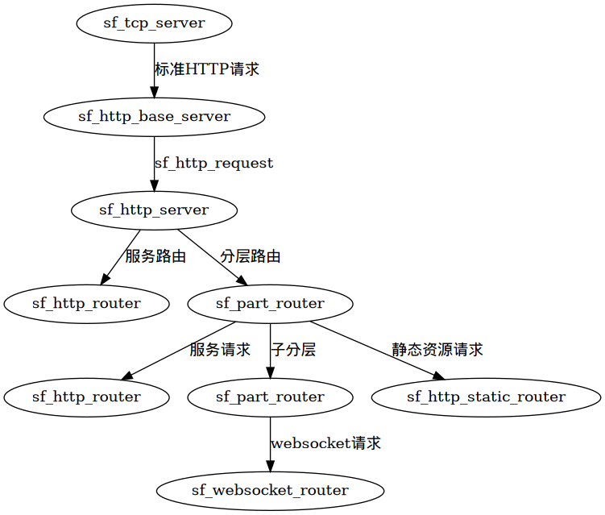

# HTTP框架指南

## 概览

sf_http_server 是 sflib 中的http框架，底层基于 sf_tcp_server，其框架结构如下：



从浏览器（客户端）发起的连接由 sf_tcp_server 处理， sf_tcp_server 将接收到的数据转发给 sf_http_base_server， sf_http_base_server会解析http请求，封装为sf_http_request 调用回调函数进行处理，而这些回调函数是由 sf_http_server 使用router机制提供。sf_http_server 可以设置多种router：

* sf_http_router 服务请求路由。通常一些查询类的请求可以通过此router处理。
* sf_static_router 静态资源路由。该路由处理静态资源请求。
* sf_websocket_router websockte路由。该路由用于相应websocket请求。
* sf_part_router 分层路由。该路由可以拦截或者分发请求到下一层路由，分层路由使得每个服务可以模块化组织。

在相应的路由处理完请求后，会有一个响应（sf_http_response）被构建，该响应返回到sf_http_base_server, 经sf_http_base_server调用sf_tcp_server返回浏览器（客户端）。

## 入门

现在我们从头搭建一个http服务器。（Linux环境下）

sf_http_server依赖zlib和openssl，编译器版本要求gcc 9.1及以上。

编写服务器代码：

```cpp
// main.cpp

#include "sf_http_server.hpp"
#include "sf_http_router.hpp"

using namespace std;
using namespace skyfire;

int main(){
    sf_http_server_config conf;
    conf.host = "0.0.0.0";
    conf.port = 8080;

    auto server = sf_http_server::make_instance(conf);
    server->add_router(sf_http_router::make_instance("/"s, 
        function([](const sf_http_request& req, sf_http_response &res){
            res.set_text("hello world");
        })
    ));
    server->start();
}
```

使用g++编译：

```bash
g++ main.cpp -I ../sflib/ -lpthread -lcrypto -lssl -lstdc++fs -lz -std=c++2a -o main
```

其中../sflib为sflib库所在目录。

运行：

```base
./main
```

打印出server配置并停顿说明运行成功，http服务已启动：

```text
[INFO ][2019-09-28 00:35:30][139725116159872][../sflib/sf_http_base_server.hpp (614) sf_http_base_server] --> [server config:][{"tmp_file_path":".","max_cache_file_size":1048576,"debu
g":false,"host":"0.0.0.0","port":8080,"session_timeout":1800,"max_cache_count":1024}]
```
另起一个终端使用curl测试，或者直接使用浏览器访问[http://localhost:8080](http://localhost:8080)

```bash
curl http://localhost:8080
```

可以看到打印的`hello world`，同时server会打印出请求日志。

或者使用：

```bash
curl -v http://localhost:8080
```

查看更详细的请求信息。

返回信息大致如下：

```text
*   Trying ::1:8080...
* TCP_NODELAY set
* connect to ::1 port 8080 failed: Connection refused
*   Trying 127.0.0.1:8080...
* TCP_NODELAY set
* Connected to localhost (127.0.0.1) port 8080 (#0)
> GET / HTTP/1.1
> Host: localhost:8080
> User-Agent: curl/7.65.3
> Accept: */*
> 
* Mark bundle as not supporting multiuse
< HTTP/1.1 200 OK
< Connection:Close
< Content-Type:text/plain
< Content-Length:11
< Server:SkyFire HTTP Server
< Set-Cookie:_SESSION_ID=188E0AA8-EA4F-A317-83F7-DC139D70568D;Path=/;HttpOnly;
< 
* Closing connection 0
hello world
```

## 使用 sf_http_part_router 进行拦截与分发

sf_http_part_router 用于对路由进行分层，同时有拦截的功能。

```cpp
// main.cpp

#include "sf_http_part_router.hpp"
#include "sf_http_router.hpp"
#include "sf_http_server.hpp"

using namespace std;
using namespace skyfire;

int main()
{
    sf_http_server_config conf;
    conf.host = "0.0.0.0";
    conf.port = 8080;

    auto server = sf_http_server::make_instance(conf);

    int n = 0;

    auto info_router = sf_http_part_router::make_instance("/info"s,
        function([&n](const sf_http_request& req, sf_http_response& res) {
            if (n++ < 3) {
                return true;
            } else {
                res.set_status(403);
                return false;
            }
        }));

    server->add_router(info_router);

    info_router->add_router(sf_http_router::make_instance("/"s,
        function([&n](const sf_http_request& req, sf_http_response& res) {
            res.set_text("you got message: " + to_string(n));
        })));

    server->start();
}
```

上述代码使用了 sf_http_part_router 对 /info 的访问进行了次数限制。注意 sf_http_part_router::make_instance 的第二个参数是一个返回bool值的可调用对象，如果返回 true，则该请求会向下层路由做匹配，否则会在本层直接返回。

sf_http_part_router 和 sf_http_server 一样有 add_router 接口，且参数保持一致，所以可以将路由组织为树状结构。

## 静态路由

使用静态路由可以将本地路径下的文件供浏览器（客户端）访问：

```cpp
// main.cpp

#include "sf_http_router.hpp"
#include "sf_http_server.hpp"
#include "sf_http_static_router.hpp"

using namespace std;
using namespace skyfire;

int main()
{
    sf_http_server_config conf;
    conf.host = "0.0.0.0";
    conf.port = 8080;

    auto server = sf_http_server::make_instance(conf);

    server->add_router(sf_static_router::make_instance("./"s));

    server->start();
}
```

此代码将当前工作目录供外部访问。使用 curl 获取本源文件内容：

```bash
curl -v http://localhost:8080/main.cpp
```

输出：

```text
*   Trying ::1:8080...
* TCP_NODELAY set
* connect to ::1 port 8080 failed: Connection refused
*   Trying 127.0.0.1:8080...
* TCP_NODELAY set
* Connected to localhost (127.0.0.1) port 8080 (#0)
> GET /main.cpp HTTP/1.1
> Host: localhost:8080
> User-Agent: curl/7.65.3
> Accept: */*
> 
* Mark bundle as not supporting multiuse
< HTTP/1.1 200 OK
< Content-Type:application/octet-stream
< Connection:Close
< Content-Length:420
< Date:Sat, 28 Sep 2019 01:40:32 GMT
< Server:SkyFire HTTP Server
< Set-Cookie:_SESSION_ID=E4B04384-554C-9938-FA5D-F50871964385;Path=/;HttpOnly;
< 
// main.cpp

#include "sf_http_router.hpp"
#include "sf_http_server.hpp"
#include "sf_http_static_router.hpp"

using namespace std;
using namespace skyfire;

int main()
{
    sf_http_server_config conf;
    conf.host = "0.0.0.0";
    conf.port = 8080;

    auto server = sf_http_server::make_instance(conf);

    server->add_router(sf_static_router::make_instance("./"s));

    server->start();
}
* Closing connection 0
```

静态路由通常与分层路由结合使用。

## websocket

sf_http_server 支持 websocket 协议，如下：

```cpp
// main.cpp

#include "sf_http_server.hpp"
#include "sf_websocket_router.hpp"

using namespace std;
using namespace skyfire;

int main()
{
    sf_http_server_config conf;
    conf.host = "0.0.0.0";
    conf.port = 8080;

    auto server = sf_http_server::make_instance(conf);

    server->add_router(sf_websocket_router::make_instance("/ws"s, function([](const sf_websocket_param_t& p) {
        if (p.type == websocket_data_type::TextData) {
            p.p_server->send_websocket_data(p.sock, "hello:" + p.text_msg);
        }
    })));

    server->start();
}
```

可使用 wscat 工具进行测试：

```text
skyfire@skyfire-pc ~/D/test_sflib> wscat -c ws://127.0.0.1:8080/ws
connected (press CTRL+C to quit)
> skyfire
< hello:skyfire
> test
< hello:test
> ⏎                   
```

详情请参阅API文档。

## 使用session

示例代码如下：

```cpp
// main.cpp

#include "sf_http_server.hpp"
#include "sf_websocket_router.hpp"

using namespace std;
using namespace skyfire;

int main()
{
    sf_http_server_config conf;
    conf.host = "0.0.0.0";
    conf.port = 8080;

    auto server = sf_http_server::make_instance(conf);

    server->add_router(sf_http_router::make_instance("/test_session"s,
        function([&server](const sf_http_request& req, sf_http_response& res) {
            auto ss = server->session(req.session_id());
            if (!ss.has("my_session")) {
                res.set_text("no session");
                ss["my_session"] = "my session content";
            } else {
                res.set_text(string(ss["my_session"]));
            }
        })));

    server->start();
}
```

使用浏览器访问 [http://localhost:8080/test_session](http://localhost:8080/test_session)进行测试。


